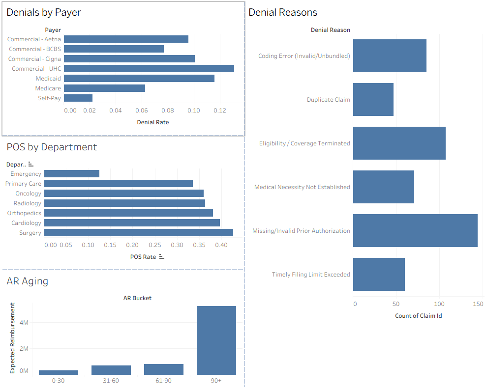

# Hospital Revenue Cycle Analytics — Denials, AR Aging & POS Collections

SQL + dashboard analysis of a hospital's revenue cycle, surfacing where revenue
leaks out of the system and where front-end (Patient Access) fixes would recover
the most money.

> **Data note:** This project uses a **synthetic** claims dataset (6,000 records,
> generated programmatically — no real patient data). Distributions are tuned so
> that standard revenue-cycle KPIs behave realistically. Method is identical to
> what you'd run against a real EHR/billing extract.

## Business questions
- What is our denial rate, and which **payers** and **denial reasons** drive it?
- How much denied revenue is **preventable** upstream (prior auth / eligibility)?
- How much money is aging in **accounts receivable**, and how much is in the 90+ danger zone?
- Which departments collect the least at **point of service**?

## Key findings
- **8.6% overall denial rate.** UnitedHealthcare was the worst payer at **13.1%**.
- **~49% of all denials** came from just two preventable causes — missing prior
  authorization (28%) and terminated eligibility (21%).
- **~$949K in preventable denied revenue** across 251 claims — recoverable by
  tightening financial clearance at registration.
- **$5.2M sits in 90+ day AR**, the bad-debt danger zone — the largest aging bucket.
- **Emergency collected only 12.5% at point of service** vs. 40%+ for scheduled
  departments, consistent with care preceding registration.

## Tools
- **SQL** (SQLite) — all KPI logic: window functions, CASE bucketing, aggregation
- **Tableau Public** — interactive dashboard *(link + screenshot below)*
- **Python / pandas** — synthetic data generation

## Repo contents
| File | What it is |
|---|---|
| `revenue_cycle_claims.csv` | Synthetic claims dataset (6,000 rows) |
| `revenue_cycle_analysis.sql` | All analysis queries (documented) |
| `generate_data.py` | Reproducible data generator |

## How to run
```bash
sqlite3 revcycle.db
.mode csv
.import revenue_cycle_claims.csv claims
.read revenue_cycle_analysis.sql
```

## Dashboard
*(Add your Tableau Public link and a screenshot here.)*



## Revenue-cycle KPIs computed
Denial rate · first-pass resolution rate · net collection rate · POS collection
rate · days in AR · AR aging buckets · charge lag · preventable-denial dollars.
